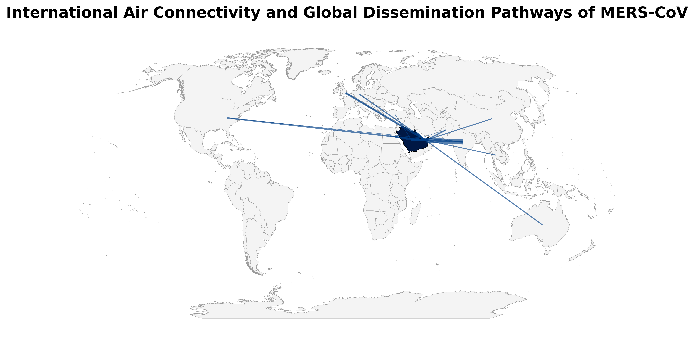
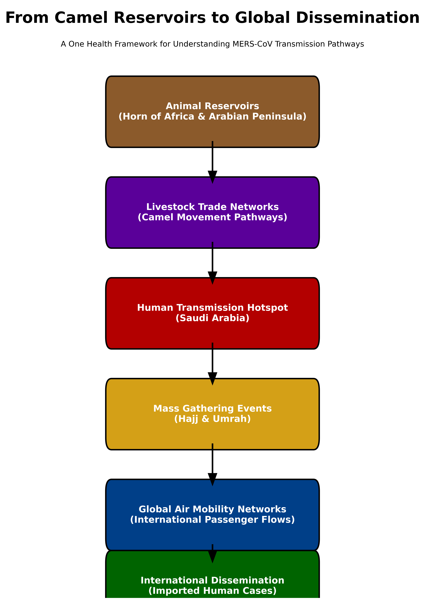

# MERS-CoV One Health Spatial Risk Analysis  
## How a Camel Virus Became a Global Health Threat

## Project Overview

Middle East Respiratory Syndrome Coronavirus (MERS-CoV) is a zoonotic disease first identified in 2012, primarily affecting countries in the Arabian Peninsula.

This project explores how a virus maintained in camel reservoirs evolved into an international health risk through interconnected pathways involving livestock trade, human spillover, mass gatherings, and global air travel.

This work was developed as part of an MSc Global Health GIS project at the University of Bonn.

---

## Research Question

How did MERS-CoV evolve from a camel-associated zoonotic virus into a global One Health threat?

---

## Project Objectives

- Map global MERS cases
- Analyze camel trade networks
- Assess aviation connectivity
- Understand dissemination pathways

---

## Methodology

FAOSTAT Camel Trade Data  
→ WHO MERS Case Data  
→ Python Data Analysis  
→ QGIS Spatial Mapping  
→ Risk Assessment  
→ One Health Interpretation  

---

## Key Findings

### Saudi Arabia: Primary Human Amplification Zone
Saudi Arabia remains the dominant hotspot for human MERS transmission.

### Horn of Africa: Critical Reservoir Link
Camel trade routes from Somalia, Djibouti, and Sudan remain major spillover pathways.

### UAE: Major Mobility Hub
The UAE acts as a major international aviation hub linking the Arabian Peninsula to global population centers.

### Hajj and Umrah: Amplification Risk
Mass gatherings significantly increase international transmission risk.

### South Korea: Major Imported Outbreak Hotspot
South Korea demonstrated how imported cases can rapidly trigger large outbreaks outside endemic regions.

---

## Repository Structure

- Figures/
- Outputs/
- Presentation/
- Python/
- QGIS/
- References/

---

## Tools Used

- Python
- Pandas
- GeoPandas
- Matplotlib
- QGIS
- Git/GitHub

---

## Author

Martins Onyedikachi  
Medical Doctor  
MSc Global Health Candidate  
University of Bonn  

---

## Key Visual Outputs

### Global MERS Distribution Map
Shows the spatial distribution of confirmed MERS cases worldwide, highlighting Saudi Arabia as the dominant hotspot.

---

### Camel Trade Risk Map
Illustrates major camel trade pathways linking the Horn of Africa to the Arabian Peninsula.

---

### Aviation Connectivity Map
Shows international passenger mobility routes that facilitate potential global dissemination.

---

### One Health Transmission Pathway
Integrated conceptual model showing the progression from animal reservoirs to global dissemination.

